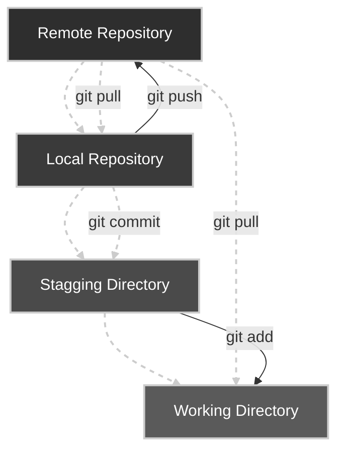
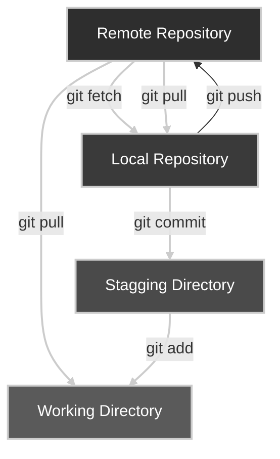
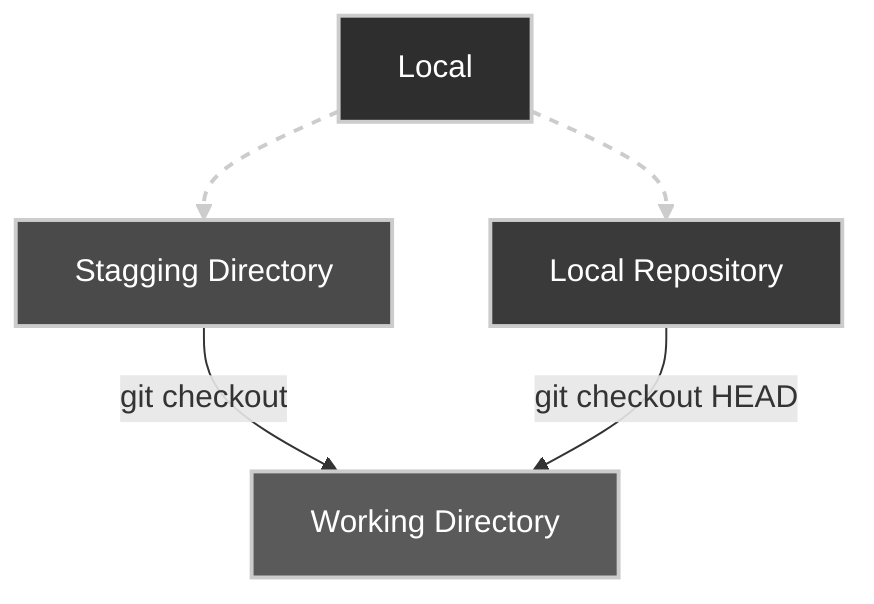
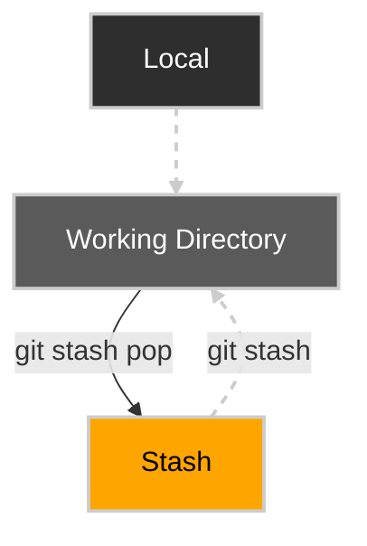
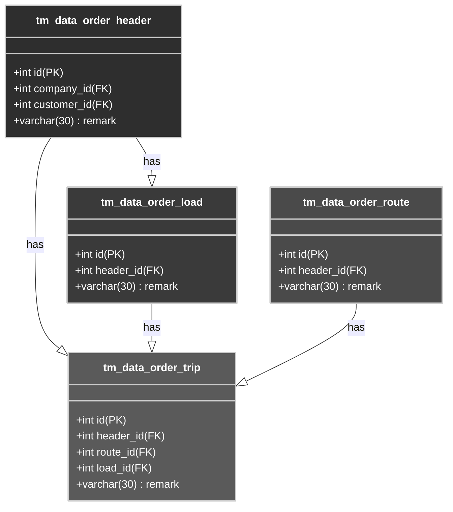

# Clone Repository

Go to your project folder

```bash copy
git clone https://git.ptsenopati.com/dev/senar.git
```


## Create your local branch

```bash copy
git branch yohan
```

## Checkout to your branch

```bash copy
git checkout yohan
```

## Check branch

```bash copy
git branch
```

## Push

The git push command is used to upload local repository content to a remote repository. Pushing is how you transfer commits from your local repository to a remote repo.

```bash copy
git pull origin main
git add .
git commit -m 'Alasan commit'
git push origin yohan
```



## Fetch vs Pull

The key difference between git fetch and pull is that git pull copies changes from a remote repository directly into your working directory, while git fetch does not. The git fetch command only copies changes into your local Git repo. The git pull command does both.



### Fetch

Git fetch is a primary command used to download contents from a remote repository. git fetch is used in conjunction with git remote , git branch , git checkout , and git reset to update a local repository to the state of a remote. The git fetch command is a critical piece of collaborative git work flows.

```bash copy
git fetch origin main
```

check status

```bash copy
git status
```

### Pull

The git pull command is used to fetch and download content from a remote repository and immediately update the local repository to match that content. Merging remote upstream changes into your local repository is a common task in Git-based collaboration work flows.

```bash copy
git pull origin main
```

check status

```bash copy
git status
```

### Checkout

The git checkout command lets you navigate between the branches created by git branch . Checking out a branch updates the files in the working directory to match the version stored in that branch, and it tells Git to record all new commits on that branch.



## Stash

The git stash command takes your uncommitted changes (both staged and unstaged), saves them away for later use, and then reverts them from your working copy. For example: $ git status On branch main Changes to be committed: new file: style. css Changes not staged for commit: modified: index.




